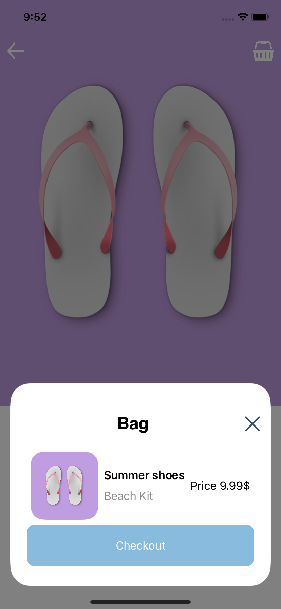

# Savates - Week-End UI Challenge

This file is part of an Instagram Challenge. I'm part of an iOS developer comunity and every week-end we try to bring designers ideas to life.

I code this Challenge only with SwiftUI.

Savates is an app that let you choose your shoes, and this code is made by myself and free to consult and reuse.  

# Screenshots

Here are the screenshots for the project 

